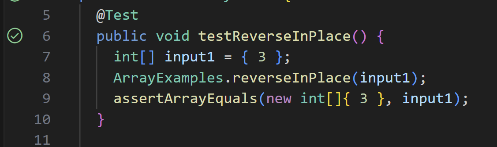

## Student Post
  
  
Hello, I was having issues with the `reverseInPlace` test in `ArrayTests.java`. I'm pretty sure that I did the method correctly, so I think that it might have something to do with JUnit. The `assert` is giving the error saying that they are not the same and giving a jumble of letters and numbers. Overall, I think this error has something to do with the stucture of my JUnit test. Thank you for any feedback!

## TA Feedback
What do you think the `assert` is testing? Do you remember learning about the difference between `==` and `equals()`? This case is pretty similar, so I think you could look into various `assert` methods to gain a better understanding of what exactly they are testing. Good luck!

## Student Response
  
Thank you, it works now! I looked into different `assert` methods and learned that the issue was with the one that I was using. I was using `assertEquals`, where the underlying process was the `equals()` method. It seems that arrays don't override this method, which is why there was an error as they are compared as two separate objects which are non-equal. I think that this is what JUnit was showing with how to displayed two different references in the error that I got. So, using `assertArrayEquals()`, the contents of the arrays are compared and it works as expected. I noticed that this is also similar to how we have to compare arrays using `Arrays.equals()` instead of just `equals()`. Thank you for the help!

## Information about setup 
  
  
  
  
  
To fix the bug, the change that was needed was to change the `assert` used. So, instead of `assertEquals`, use `assertArrayEquals`.

## Reflection
One thing that I found really cool was `vim`. I think this was my favorite topic within this course, since I liked that I could edit files even if only with a terminal. I really liked how we learned with `vimtutor` and that now I could do more with just a terminal. I think that the professor mentioned once that this skill was useful in things that robotics, when you have to edit code using the terminal. As this is something that I am interested in working on in the future, I think that this skill will be useful for me to know. There are still ton of shortcuts that I can learn within `vim` but I think that I have gotten a lot better at using it.
